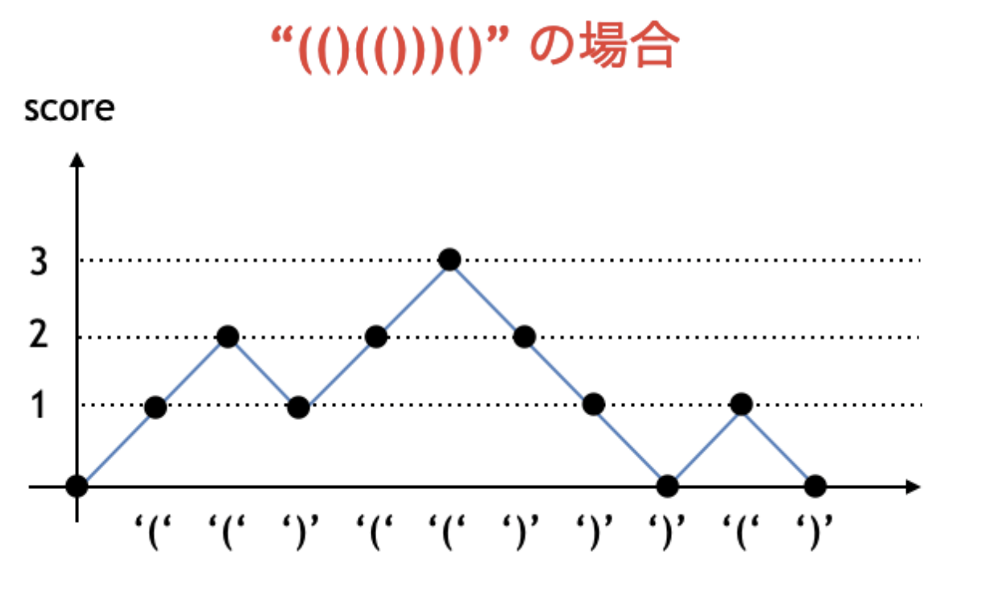

# 典型90問

## 問題01「ようかんパーティ」

長さ L [cm] のようかんがあります。左から A₁, A₂, ..., Aₙ [cm] の位置に N 個の切れ目が入っています。  
この中から K 個の切れ目を選び、ようかんを **K+1 個のピース** に分けるとき、  
その **K+1 個のピースのうち最も短いものの長さ（スコア）** を最大化するにはどうすればよいかを求める問題。

- 入力:    
N L  
K  
A₁ A₂ ... Aₙ

## 解法方針

この問題は「**最小値の最大化**」という典型的な二分探索のパターンに分類される。

### 思考

- スコア `x` を仮定し、ピースの長さが全て `x` 以上になるように分割できるかをチェック。
- `x` を 0〜L+1(最大値は大きすぎてもまあOK) で **二分探索**して、最大化できる `x` を求める。

### 二分探索

- スコアの最小値は 0、最大値は L+1。
- 上限 `max = L + 1` を設定し、 `(max + min) // 2` を試しながら探索。

## 問題02「Encyclopedia of Parentheses」

長さ N の正しいカッコ列をすべて、辞書順に出力してください。
ただし、正しいカッコ列は次のように定義されています :

・() は正しいカッコ列である  
・S が正しいカッコ列であるとき、文字列 ( +S+ ) は正しいカッコ列である  
・S,T が正しいカッコ列であるとき、文字列 S+T は正しいカッコ列である  
・それ以外の文字列はすべて、正しいカッコ列でない    

例えば、  
()()
(()())(())
()()()()()()()()  
は正しいカッコ列ですが、  

)(
)))()(((
((((a))))
は正しいカッコ列ではありません。また、 ( の方が ) よりも辞書順で早いものとします。  
「制約: 1 <= N <=20」

## 解法方針

```1 <= N <=20！```  
範囲狭いから全探索しよう(Bit全探索)  


**"("を0。  
")"を1**


として考える。  
つまり、　　  
**カッコ列の辞書順に出力→値の小さいものから出力.**   
となる

## どうやって正しいカッコ列か判断する？

この問題のように、ある文字列が整合しているのか判別する問題は超典型的！  
**score変数**を用意して対処！　　　情報源(https://drken1215.hatenablog.com/entry/2021/06/12/151200)

- score変数ーーいままで登場してきた"("の数から")"の数を引いた値。  
- ```"(" ```が来たら ```score += 1```
- ```")" ```が来たら ```score -= 1```



### 注意点

- 途中でマイナスになってはならない (この場合は` ")" `に対応する `"(" `が枯渇したことを意味する)

- 最後まで見たときに `score` が `0` でない場合はダメ

上記条件全てを満たせばOK!
